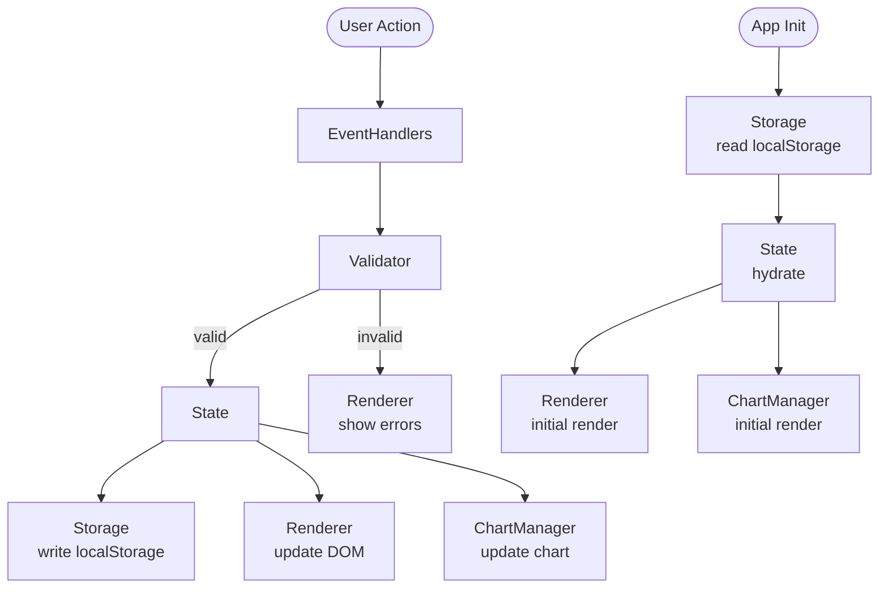

# Design Document

## Expense & Budget Visualizer

---

## Overview

The Expense & Budget Visualizer is a client-side single-page application (SPA) built with plain HTML, CSS, and vanilla JavaScript. It runs entirely in the browser with no backend, no build tools, and no package manager. All state is persisted in the browser's `localStorage`. Chart.js is loaded from a CDN `<script>` tag.

The app delivers six core capabilities:

1. Record and delete transactions (name, amount, category, timestamp)
2. Display a running total balance (with sign-aware formatting)
3. Visualize spending by category with a Chart.js pie chart
4. Sort the transaction list by amount or category
5. Manage custom categories
6. Toggle dark/light color themes

The code is organized into a single IIFE module in `js/app.js` with clearly separated internal layers: **State**, **Storage**, **Validator**, **ChartManager**, **Renderer**, and **EventHandlers**. This structure keeps the logic testable as pure functions while keeping the entry point simple.

---

## Architecture

### High-Level Structure

```
index.html
├── css/style.css          (all styles, CSS custom properties for theming)
└── js/app.js              (all logic, wrapped in a single IIFE)
     ├── State              (in-memory app state)
     ├── Storage            (localStorage read/write, serialization)
     ├── Validator          (pure validation functions)
     ├── ChartManager       (Chart.js lifecycle management)
     ├── Renderer           (DOM rendering and updates)
     └── EventHandlers      (user interaction entry points)
```

### Module Interaction Flow



### Key Design Decisions

- **No framework**: Requirements mandate no build tools and a single JS file. An IIFE module pattern provides encapsulation without bundling.
- **CSS custom properties for theming**: Dark/light mode is implemented by toggling a `data-theme` attribute on `<html>`. All colors reference `var(--token)` variables, making theme switching a single attribute flip with no JS style manipulation. Theme is applied before any other rendering (Req 9.3).
- **Theme persistence order**: `Storage.saveTheme` is called before `Renderer.applyTheme` so the preference is always persisted before the visual transition completes (Req 9.7).
- **Chart.js `update()` vs. `destroy()/new Chart()`**: The chart instance is created once on init and updated in place using `chart.data = newData; chart.update()`. This avoids flickering and canvas context leaks.
- **Deterministic category colors**: Colors are assigned from a fixed palette array in registration order and cached in a `Map` for the session lifetime, guaranteeing consistent colors across renders (Req 5.4).
- **Sort applied at render time**: Sorting is not stored in the transaction array. `sortTransactions(state.transactions, state.sortOrder)` is called every time the list is rendered, keeping the stored data order-independent. `sortTransactions` is a pure function and never mutates its input array.
- **Delete-before-update pattern**: When deleting a transaction, `Storage.saveTransactions` is called with the filtered list *before* updating `state.transactions`. If the save throws, the in-memory state is not modified and an error is shown (Req 3.5).
- **Serialization as named pure functions**: `serializeTransactions` and `deserializeTransactions` are extracted from Storage as named pure functions so they can be tested independently of `localStorage`.

---

## Components and Interfaces

### 1. State Object

The single source of truth for the app's runtime data.

```js
const state = {
  transactions: [],         // Transaction[]
  categories: [],           // string[]  (built-ins prepended: ['Food', 'Transport', 'Fun'] + custom)
  sortOrder: 'amount-asc',  // SortOrder
  theme: 'light',           // 'light' | 'dark'
};
```

Built-in categories (`'Food'`, `'Transport'`, `'Fun'`) are always present at the front of the array; custom categories are appended after them. The distinction is maintained by loading built-ins at init and appending `loadCategories()` results.

### 2. Storage Module

Responsible for all `localStorage` interactions. Every public function is wrapped in a `try/catch` that surfaces errors to the caller.

| Function | Signature | Description |
|---|---|---|
| `serializeTransactions` | `(transactions: Transaction[]) => string` | Pure function. Serializes array to JSON string. |
| `deserializeTransactions` | `(json: string) => Transaction[]` | Pure function. Parses JSON; filters out entries with missing or invalid required fields (`id`, `itemName`, `amount`, `category`, `date`); returns `[]` on parse error. |
| `saveTransactions` | `(transactions: Transaction[]) => void` | Calls `serializeTransactions` → `localStorage.setItem(LS_KEY_TRANSACTIONS, ...)`; wrapped in `try/catch`. |
| `loadTransactions` | `() => Transaction[]` | Reads raw JSON from `LS_KEY_TRANSACTIONS` and calls `deserializeTransactions`; returns `[]` on any error. |
| `saveCategories` | `(categories: string[]) => void` | Serializes to `LS_KEY_CATEGORIES`; wrapped in `try/catch`. |
| `loadCategories` | `() => string[]` | Returns `[]` on error. Only custom categories (not built-ins) are persisted here. |
| `saveSortOrder` | `(order: SortOrder) => void` | Writes to `LS_KEY_SORT`; wrapped in `try/catch`. |
| `loadSortOrder` | `() => string` | Returns the raw stored string; returns `''` on error. Pass result through `parseSortOrder` to canonicalize. |
| `saveTheme` | `(theme: Theme) => void` | Writes to `LS_KEY_THEME`; swallows errors silently (Req 9.6). |
| `loadTheme` | `() => string` | Returns the raw stored string; returns `''` on error. Pass result through `resolveTheme` to canonicalize. |
| `resolveTheme` | `(raw: string \| undefined) => Theme` | Pure function. Returns `'dark'` only if `raw === 'dark'`; returns `'light'` for all other values including `undefined`, `null`, and unrecognized strings (Req 9.3, 9.6). |

**LocalStorage keys (hardcoded constants):**

```js
const LS_KEY_TRANSACTIONS = 'ebv_transactions';
const LS_KEY_CATEGORIES   = 'ebv_categories';
const LS_KEY_SORT         = 'ebv_sort_order';
const LS_KEY_THEME        = 'ebv_theme';
```

**Separation of `loadTheme`/`resolveTheme` and `loadSortOrder`/`parseSortOrder`**: The raw read and the canonicalization are separated so that `resolveTheme` and `parseSortOrder` can be tested as pure functions without mocking `localStorage`.

### 3. Validator Module

Pure functions with no side effects. Each returns `null` on success or an error string on failure.

| Function | Signature | Description |
|---|---|---|
| `validateItemName` | `(name: string) => string \| null` | Rejects empty string, whitespace-only string, or string exceeding 100 characters. |
| `validateAmount` | `(raw: string) => string \| null` | Rejects non-numeric, `NaN`, `Infinity`, `≤ 0`, or `> 999,999,999.99`. |
| `validateCategory` | `(name: string, existing: string[]) => string \| null` | Rejects empty, whitespace-only, `> 50` characters, or case-insensitive duplicate of any entry in `existing`. |
| `validateTransaction` | `(form: FormData, existing: string[]) => ValidationResult` | Runs `validateItemName`, `validateAmount`, and `validateCategory`; returns `{ isValid, errors }`. |
| `parseSortOrder` | `(raw: string \| undefined) => SortOrder` | Pure function. Returns `'amount-asc'` for any value that is not exactly `'amount-asc'`, `'amount-desc'`, or `'category-asc'`, including `null` and `undefined`. |

### 4. ChartManager Module

Manages the Chart.js pie chart lifecycle.

| Function | Description |
|---|---|
| `init(canvasId)` | Primary CDN failure detection is handled by the `onerror` handler on the Chart.js `<script>` tag (see CDN Failure in Error Handling). `init` checks the module-level `chartUnavailable` flag (set by that handler) and also guards with `typeof Chart === 'function'` as a safety fallback; if either condition indicates Chart.js is absent, calls `Renderer.showError(CDN_ERROR_MSG)` and returns without creating a chart instance. Otherwise creates a new Chart.js pie chart and stores it. |
| `update(transactions, categories)` | If `transactions` is empty, calls `showEmptyState()`; otherwise calls `hideEmptyState()`, computes new chart data via `computeChartData`, and calls `chart.data = newData; chart.update()`. |
| `showEmptyState()` | Hides the `<canvas>` element and shows the "No spending data is available" placeholder. |
| `hideEmptyState()` | Shows the `<canvas>` element and hides the placeholder. |

**`computeChartData(transactions)`** — pure function:

- Groups transactions by `category` label, summing `amount` per group.
- Returns `{ labels: string[], data: number[], colors: string[] }`.
- Calls `assignCategoryColor(label)` for each distinct label to obtain the color string.
- The returned `data` values are numbers rounded to 2 decimal places.

**`assignCategoryColor(label)`** — pure output, deterministic per session:

- Maintains a module-level `Map<string, string>` (`categoryColorMap`) that is initialized as `new Map()` when the IIFE executes and is **never read from or written to `localStorage`**. It is discarded on every page reload.
- On first call for a label within a session, picks the next unused color from `COLOR_PALETTE` (cycling if the palette is exhausted) and caches it in `categoryColorMap`.
- Returns the cached color on every subsequent call for the same label within the same session, guaranteeing per-session color stability (Req 5.4).
- Colors assigned in one session are **not guaranteed to match** those assigned in a different session or after a page reload.

### 5. Renderer Module

Handles all DOM mutation. Reads from `state`, writes to DOM. None of the Renderer functions mutate `state`.

| Function | Description |
|---|---|
| `renderTransactionList(transactions, sortOrder)` | Calls `sortTransactions(transactions, sortOrder)` (non-mutating) then generates HTML for each transaction; inserts into `#transaction-list`. Renders empty-state message if array is empty. |
| `renderBalance(transactions)` | Calls `computeBalance` then `formatBalance`; sets `#total-balance` text content. Positive values have no sign prefix; negative values have a `-` prefix (Req 4.4, 4.5). |
| `renderCategorySelector(categories)` | Clears `#category-select` and repopulates `<option>` elements from the full categories array (built-ins + custom). |
| `renderSortControl(sortOrder)` | Sets the `selected` attribute on the matching `<option>` in `#sort-select`. |
| `showFormErrors(errors)` | Inserts a `<span class="field-error" id="err-{field}">` after each failing field's `<input>`; sets `aria-describedby` on the input to the span's `id`. |
| `clearFormErrors()` | Removes all `.field-error` elements and clears `aria-describedby` attributes on inputs. |
| `applyTheme(theme)` | Calls `document.documentElement.setAttribute('data-theme', theme)`. |
| `showWarning(message, durationMs)` | Inserts `<div role="status" class="warning-banner">` in the DOM; schedules removal via `setTimeout(durationMs)`. Minimum visible duration is 5000ms for LocalStorage-related warnings (Req 6.3). |
| `showError(message)` | Inserts `<div role="alert" class="error-banner">` (persistent until page reload or user dismissal). |

**`computeBalance(transactions)`** — pure function:

- Returns the arithmetic sum of all `t.amount` values, rounded to exactly 2 decimal places using `Math.round`.
- Returns `0.00` (as a number) for an empty array.
- The caller (`formatBalance`) is responsible for sign-aware string formatting.

**`formatBalance(value)`** — pure function:

- Returns a string with exactly 2 decimal places (`toFixed(2)`).
- Negative values are prefixed with `-` (e.g., `-12.50`).
- Positive values and zero have no sign prefix (e.g., `42.00`, `0.00`) (Req 4.4, 4.5).

**`sortTransactions(transactions, order)`** — pure function, defined alongside Renderer utilities:

- Returns a new sorted array without mutating the input (uses `[...transactions].sort(...)`).
- Sort comparators:

| Sort Order | Primary Key | Tiebreaker |
|---|---|---|
| `amount-asc` | `amount` ascending | `date` ascending |
| `amount-desc` | `amount` descending | `date` ascending |
| `category-asc` | `category` alphabetical (`localeCompare`, locale-insensitive) | `date` ascending |

### 6. EventHandlers Module

Wires DOM events to state mutations and re-renders. These are the only functions with side effects beyond Storage.

| Handler | Trigger | Actions |
|---|---|---|
| `onFormSubmit` | `#expense-form` `submit` event | Validate → on error: `Renderer.showFormErrors`, return. On valid: `Renderer.clearFormErrors`, create Transaction with `crypto.randomUUID()` id and `new Date().toISOString()` date, push to `state.transactions`, `Storage.saveTransactions`, `Renderer.renderBalance`, `Renderer.renderTransactionList`, `ChartManager.update`, reset form and focus `#item-name` within 200ms. |
| `onDeleteClick` | `click` delegated on `#transaction-list` for `.delete-btn` | Read `data-id`; attempt `Storage.saveTransactions(filteredList)` first — if throws: `Renderer.showError(...)`, abort. On success: update `state.transactions`, `Renderer.renderBalance`, `Renderer.renderTransactionList`, `ChartManager.update`. |
| `onSortChange` | `#sort-select` `change` event | Call `parseSortOrder(value)` → update `state.sortOrder` → `Storage.saveSortOrder` → `Renderer.renderTransactionList`. |
| `onAddCategory` | `#add-category-btn` `click` event | Validate via `validateCategory(name, state.categories)` → on error: show inline error, return. On valid: push to `state.categories`, `Storage.saveCategories`, `Renderer.renderCategorySelector`, clear `#custom-category-input`. |
| `onThemeToggle` | `#theme-toggle` `click` event | Flip `state.theme`; **call `Storage.saveTheme` first**, then `Renderer.applyTheme`; update toggle label/icon to reflect new state (Req 9.1, 9.7). |

**Delete ordering note**: The delete handler saves to `localStorage` before modifying `state.transactions`. This ensures that if the save fails, the UI reflects the actual persisted state (Req 3.5).

**Theme persistence ordering note**: `saveTheme` is called before `applyTheme` to guarantee the preference is written to `localStorage` before the visual transition is applied to the DOM (Req 9.7).

---

## Data Models

### Transaction

```js
/**
 * @typedef {Object} Transaction
 * @property {string} id          - UUID v4, generated via crypto.randomUUID() at creation time
 * @property {string} itemName    - Non-empty, max 100 characters
 * @property {number} amount      - Positive float, range 0.01 – 999,999,999.99
 * @property {string} category    - One of the current categories list at time of creation
 * @property {string} date        - ISO 8601 timestamp (new Date().toISOString())
 */
```

A Transaction is considered **valid** for deserialization purposes when all five fields are present and:
- `id` is a non-empty string
- `itemName` is a non-empty string
- `amount` is a finite positive number
- `category` is a non-empty string
- `date` is a non-empty string

Entries failing any of these checks are silently discarded by `deserializeTransactions`.

### SortOrder

```js
/**
 * @typedef {'amount-asc' | 'amount-desc' | 'category-asc'} SortOrder
 */
```

Any value not matching one of these three strings is canonicalized to `'amount-asc'` by `parseSortOrder` (Req 7.6).

### Theme

```js
/**
 * @typedef {'light' | 'dark'} Theme
 */
```

`resolveTheme` returns `'dark'` only for the exact string `'dark'`; all other values (including `undefined`, empty string, unrecognized strings) return `'light'` (Req 9.3, 9.6).

### ValidationResult

```js
/**
 * @typedef {Object} ValidationResult
 * @property {boolean} isValid
 * @property {{ itemName?: string, amount?: string, category?: string }} errors
 *   // Each key is absent when the field passes validation; present with an error string when it fails.
 */
```

### ChartData

```js
/**
 * @typedef {Object} ChartData
 * @property {string[]} labels   - Distinct category names appearing in the transaction list
 * @property {number[]} data     - Per-category totals (indexed to match labels)
 * @property {string[]} colors   - CSS color strings (indexed to match labels)
 */
```

---

## Correctness Properties

*A property is a characteristic or behavior that should hold true across all valid executions of a system — essentially, a formal statement about what the system should do. Properties serve as the bridge between human-readable specifications and machine-verifiable correctness guarantees.*

---

### Property 1: Valid transactions are persisted and retrievable

*For any* valid transaction object (non-empty `itemName` ≤ 100 chars, `amount` in 0.01–999,999,999.99, non-empty `category`, non-empty `date`, non-empty `id`), calling `deserializeTransactions(serializeTransactions([t]))` SHALL return a list containing a structurally equivalent transaction with identical `itemName`, `amount`, `category`, and `date` values.

**Validates: Requirements 1.2, 6.1, 6.2**

---

### Property 2: Invalid transaction inputs are always rejected

*For any* combination of invalid field values — where "invalid" means `itemName` is empty or whitespace-only or exceeds 100 characters, `amount` is non-numeric, `NaN`, `≤ 0`, or `> 999,999,999.99`, or any required field is absent — `validateTransaction` SHALL return `isValid: false` and the transaction list SHALL remain unchanged in length.

**Validates: Requirements 1.3, 1.4**

---

### Property 3: Transaction list rendering includes all fields for every entry

*For any* non-empty array of transactions, the HTML produced by `renderTransactionList` SHALL contain each transaction's `itemName`, formatted `amount`, `category`, and `date` string, and each transaction item SHALL include exactly one delete control element bearing the transaction's `id` as a `data-id` attribute.

**Validates: Requirements 2.1, 2.5, 3.1**

---

### Property 4: Balance equals the exact sum of all transaction amounts

*For any* array of transactions (including the empty array), `computeBalance` SHALL return a value equal to the arithmetic sum of all `amount` fields rounded to exactly 2 decimal places. For an empty array the result SHALL be `0.00`. `formatBalance(computeBalance([]))` SHALL return the string `'0.00'`.

**Validates: Requirements 4.1, 4.2, 4.3**

---

### Property 5: Deleting a transaction decrements the balance by that transaction's amount

*For any* non-empty array of transactions and any transaction `t` in that array, `computeBalance(array.filter(x => x.id !== t.id))` SHALL equal `computeBalance(array) - t.amount`, both rounded to 2 decimal places.

**Validates: Requirements 3.3, 4.2**

---

### Property 6: Chart data reflects per-category totals

*For any* array of transactions, `computeChartData` SHALL return a `ChartData` object where:
- Every distinct `category` value in the array appears exactly once in `labels`.
- Each `data[i]` equals the sum of `amount` for all transactions whose `category` matches `labels[i]`, rounded to 2 decimal places.
- `sum(data)` equals `computeBalance(transactions)`.
- `labels`, `data`, and `colors` are all the same length.

**Validates: Requirements 5.1, 5.2, 8.6**

---

### Property 7: Category colors are unique and stable within a session

*For any* set of two or more distinct category label strings registered during the same session, `assignCategoryColor` SHALL assign a different CSS color string to each label. Calling `assignCategoryColor` with the same label any number of times within the same session SHALL always return the same color string. Color assignments are held in an in-memory `Map` that is reset on every page load; the same label MAY receive a different color in a different session.

**Validates: Requirements 5.4**

---

### Property 8: Transaction list LocalStorage round-trip preserves all valid entries and discards all invalid ones

*For any* array that is a mix of valid Transaction objects and objects with missing or invalid required fields, after calling `saveTransactions(array)` (which writes to `localStorage`) and then calling `loadTransactions()` (which reads from `localStorage`), the result SHALL contain every entry from `array` that satisfies all Transaction validity criteria, and SHALL exclude every entry that fails any validity criterion.

**Validates: Requirements 6.1, 6.2, 6.4**

---

### Property 9: Sort order is correct for all inputs and sort keys

*For any* array of transactions and any `SortOrder` value, `sortTransactions(transactions, order)` SHALL:
- Return an array of the same length as the input.
- Not mutate the input array.
- For `'amount-asc'`: satisfy `transactions[i].amount ≤ transactions[i+1].amount` for every adjacent pair.
- For `'amount-desc'`: satisfy `transactions[i].amount ≥ transactions[i+1].amount` for every adjacent pair.
- For `'category-asc'`: satisfy `transactions[i].category.localeCompare(transactions[i+1].category) ≤ 0` for every adjacent pair.
- In all cases: when two adjacent transactions share the same primary sort key value, they SHALL be ordered by `date` ascending (lexicographic ISO 8601 comparison).

**Validates: Requirements 7.2, 7.3, 7.5**

---

### Property 10: Unrecognized sort order values always resolve to `amount-asc`

*For any* string (or `null` or `undefined`) that is not exactly `'amount-asc'`, `'amount-desc'`, or `'category-asc'`, `parseSortOrder` SHALL return `'amount-asc'`.

**Validates: Requirements 7.6**

---

### Property 11: Custom category validation rejects all invalid inputs and accepts all valid inputs

*For any* category name input where the trimmed value is empty, the raw value consists solely of whitespace, the raw value exceeds 50 characters, or the trimmed value matches any entry in the existing categories array case-insensitively, `validateCategory` SHALL return a non-null error string. Conversely, *for any* name whose trimmed length is between 1 and 50 characters inclusive and that does not case-insensitively match any existing category, `validateCategory` SHALL return `null`.

**Validates: Requirements 8.3**

---

### Property 12: Custom categories LocalStorage round-trip preserves the list

*For any* array of valid custom category name strings, after calling `saveCategories(arr)` and then calling `loadCategories()`, the result SHALL be an array with the same elements in the same order as `arr`.

**Validates: Requirements 8.4**

---

### Property 13: Theme resolution is correct for all stored values

*For any* value passed to `resolveTheme` — including `'dark'`, `'light'`, any unrecognized string, empty string, `null`, or `undefined` — `resolveTheme` SHALL return `'dark'` if and only if the input is exactly the string `'dark'`, and SHALL return `'light'` in all other cases.

**Validates: Requirements 9.3, 9.6**

---

### Property 14: Balance formatting is sign-correct for all numeric inputs

*For any* positive number `v > 0`, `formatBalance(v)` SHALL return a string that does not begin with `-`. *For any* negative number `v < 0`, `formatBalance(v)` SHALL return a string that begins with `-`. *For any* number `v`, `formatBalance(v)` SHALL return a string with exactly 2 decimal places.

**Validates: Requirements 4.4, 4.5**

---

## Error Handling

### LocalStorage Unavailability

All Storage functions are wrapped in `try/catch`. The behavior per failure context:

| Context | Failure Behavior |
|---|---|
| `loadTransactions` throws or returns unparseable JSON | Initialize with `[]`; show non-blocking warning for at least 5 seconds (Req 6.3) |
| `deserializeTransactions` discards invalid entries | Retain valid entries; show non-blocking warning indicating some data could not be restored (Req 6.4) |
| `saveTransactions` throws during add | Do NOT push to `state.transactions`; show persistent error message |
| `saveTransactions` throws during delete | Do NOT remove from `state.transactions`; show persistent error message (Req 3.5) |
| `loadCategories` throws | Initialize with no custom categories; show persistent error message (Req 8.5) |
| `saveCategories` throws | Log to console; show non-blocking warning |
| `loadSortOrder` throws | Return `''`; `parseSortOrder` will default to `'amount-asc'` (Req 7.6) |
| `saveTheme` throws | Swallow silently; theme still applied in-memory (Req 9.6) |
| `loadTheme` throws | Return `''`; `resolveTheme` will default to `'light'` (Req 9.6) |

### CDN Failure (Chart.js)

The primary detection mechanism is an `onerror` event listener (or `onerror` attribute) on the Chart.js `<script>` tag in `index.html`. When that event fires, a module-level flag `chartUnavailable` is set to `true` and `Renderer.showError(CDN_ERROR_MSG)` is called immediately — before `ChartManager.init()` runs.

`ChartManager.init()` checks both `chartUnavailable` and `typeof Chart === 'function'` as a safety guard. If either indicates Chart.js is absent, it calls `Renderer.showError(CDN_ERROR_MSG)` (no-op if the banner is already shown) and returns without creating a chart instance.

The persistent error banner message is:

> *"A required resource (Chart.js) could not be loaded. Please check your internet connection and reload the page."*

The rest of the app (transaction management, balance, sorting, categories, theme) remains fully functional; only the chart area is affected (Req 11.4).

### Input Validation Errors

Inline error messages are inserted as `<span class="field-error" id="err-{field}">` elements immediately after the relevant `<input>`. The corresponding `<input>` receives `aria-describedby="err-{field}"` for screen-reader accessibility. All error spans are removed by `clearFormErrors()` on the next submission attempt.

### Warning and Error Banners

Non-blocking warnings use `<div role="status" class="warning-banner">` and are auto-dismissed after at least 5000ms via `setTimeout`. Persistent errors use `<div role="alert" class="error-banner">` and remain visible until the user dismisses them or reloads the page.

---

## Testing Strategy

This feature mixes UI side effects (DOM rendering, chart updates, theme toggling) with pure logic functions (validation, balance computation, sorting, serialization). The testing approach uses a dual layer:

- **Property-based tests** for all pure functions — covering the universal properties defined above
- **Example-based unit tests** for specific edge cases, integration points, and UI behavior
- **Smoke tests** for file structure, cross-browser compatibility, responsive layout, and performance (manual or via Lighthouse/axe)

### Property-Based Testing

**Library**: [fast-check](https://github.com/dubzzz/fast-check) (JavaScript) — runs in Node.js via `node --experimental-vm-modules`, requiring no build tool. Import the IIFE's exported pure functions directly.

**Minimum iterations**: 100 per property test.

**Tag format**: `// Feature: expense-budget-visualizer, Property {N}: {property_text}`

| Property | Function Under Test | Generator Strategy |
|---|---|---|
| P1: Valid transactions persisted | `serializeTransactions` / `deserializeTransactions` | `fc.record({ id: fc.uuid(), itemName: fc.string({minLength:1,maxLength:100}), amount: fc.float({min:0.01,max:999999999.99,noNaN:true}), category: fc.string({minLength:1}), date: fc.date().map(d=>d.toISOString()) })` |
| P2: Invalid inputs rejected | `validateTransaction` | Separate arbitraries for each invalid subcase: `fc.constant('')` for empty name; `fc.string({minLength:101})` for long name; `fc.float({max:0,noNaN:true})` for invalid amount; `fc.constant('abc')` for non-numeric amount |
| P3: Render includes all fields + delete control | `renderTransactionList` (pure HTML output) | `fc.array(transactionArb, {minLength:1})` |
| P4: Balance equals sum | `computeBalance` | `fc.array(transactionArb)` including empty array |
| P5: Delete decrements balance | `computeBalance` before/after | `fc.array(transactionArb, {minLength:1})` + `fc.integer` for random removal index |
| P6: Chart data totals | `computeChartData` | `fc.array(transactionArb)` with at least one distinct category |
| P7: Color uniqueness + stability | `assignCategoryColor` | `fc.set(fc.string({minLength:1,maxLength:50}), {minLength:2})` for label sets |
| P8: LocalStorage round-trip | `saveTransactions` + `loadTransactions` | `fc.array(fc.oneof(transactionArb, invalidTransactionArb))` |
| P9: Sort correctness | `sortTransactions` | `fc.array(transactionArb)` × `fc.constantFrom('amount-asc','amount-desc','category-asc')` |
| P10: Invalid sort order defaults | `parseSortOrder` | `fc.string()` filtered to exclude the three valid values |
| P11: Category validation | `validateCategory` | Invalid: `fc.constant('')`, `fc.string({minLength:51})`, whitespace strings, case variants of existing. Valid: `fc.string({minLength:1,maxLength:50})` filtered to be unique |
| P12: Categories round-trip | `saveCategories` + `loadCategories` | `fc.array(fc.string({minLength:1,maxLength:50}))` |
| P13: Theme resolution | `resolveTheme` | `fc.oneof(fc.constant('dark'), fc.constant('light'), fc.constant(undefined), fc.string())` |
| P14: Balance formatting sign | `formatBalance` | `fc.float({noNaN:true})` split into positive, negative, and zero subcases |

### Example-Based Unit Tests

- Form renders all required fields: item name, amount, category selector, submit button (Req 1.1)
- Form resets and focuses `#item-name` after successful submission (Req 1.5)
- Empty transaction list shows the "no transactions recorded yet" empty-state message (Req 2.4)
- Chart shows "No spending data is available" placeholder when no transactions exist (Req 5.3)
- `saveTransactions` throwing during delete: transaction is NOT removed from list; error banner shown (Req 3.5)
- LocalStorage unavailable on init: empty list initialized, warning visible for ≥5s (Req 6.3)
- Sort control renders exactly three options: Amount Ascending, Amount Descending, Category Alphabetical (Req 7.1)
- Theme toggle is visible and its label reflects the currently active theme (Req 9.1)
- `saveTheme` is called before `applyTheme` in `onThemeToggle` (Req 9.7)
- CDN failure: `ChartManager.init` shows the error banner; rest of the app remains functional (Req 11.4)

### Smoke / Manual Tests

- Responsive layout at 320px, 481px, and 768px viewports — no horizontal scroll at any breakpoint (Req 10.1–10.3)
- All touch targets are visually at least 44×44px on a mobile viewport (Req 10.1)
- WCAG 2.1 AA color contrast in both light and dark modes — use axe DevTools (Req 9.4, 9.5)
- Cross-browser verification: Chrome, Firefox, Edge, Safari (Req 10.4)
- Page load (all assets + initial render) under 3 seconds on simulated 10 Mbps, ≤50ms latency — verify with Lighthouse (Req 10.5)
- Project contains exactly one CSS file (`css/style.css`) and exactly one JS file (`js/app.js`) (Req 11.1, 11.2)
- Opening `index.html` directly from disk (file:// protocol) without a local server renders correctly and all features work (Req 11.3)
